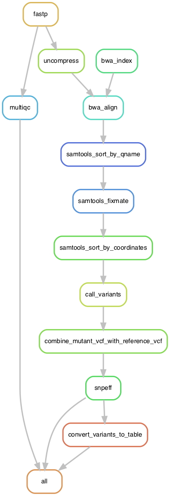

# Snakemake BSA-seq pipeline

A Snakemake pipeline to perform BSA-seq to identify causal the recessive mutation(s) underlying a mutant phenotype

<!-- MarkdownTOC autolink="true" -->

- [1. Installation 🔨](#1-installation-%F0%9F%94%A8)
	- [1.1 Install Miniconda and mamba](#11-install-miniconda-and-mamba)
	- [1.2 Clone the pipeline repository :cat:](#12-clone-the-pipeline-repository-cat)
	- [1.3 Install the Snakemake pipeline dependencies](#13-install-the-snakemake-pipeline-dependencies)
- [2. Test run 🧪](#2-test-run-%F0%9F%A7%AA)
	- [2.1 Fastq test files](#21-fastq-test-files)
	- [2.2 Reference genome](#22-reference-genome)
	- [2.3 Change default parameters if needed](#23-change-default-parameters-if-needed)
	- [2.4 Run the pipeline](#24-run-the-pipeline)
- [3. Graphs](#3-graphs)
	- [For each sample \(including reference sample\)](#for-each-sample-including-reference-sample)
	- [For one given sample](#for-one-given-sample)
- [4. References 📖](#4-references-%F0%9F%93%96)
	- [MutMap software](#mutmap-software)
	- [Snakemake](#snakemake)
	- [SnpEff](#snpeff)

<!-- /MarkdownTOC -->

# 1. Installation 🔨

## 1.1 Install Miniconda and mamba 

[Miniconda](https://docs.conda.io/en/latest/miniconda.html) is a lightweight installation of the `conda` package manager.  
[Mamba](https://mamba.readthedocs.io/en/latest/index.html) is a faster re-implementation of conda. These commands should be run inside your favorite Shell (e.g. `bash`).

To install `conda`, follow the instructions: - [Conda installation](https://docs.conda.io/projects/conda/en/latest/user-guide/install/)

Once `conda` is installed, you can get `mamba` easily in your default (base) conda environment:  

`conda install mamba -n base -c conda-forge --yes`

## 1.2 Clone the pipeline repository :cat:

From GitHub, copy the repo link: `https://github.com/SilkeAllmannLab/snakemake_bsaseq.git`

Then run `git clone https://github.com/SilkeAllmannLab/snakemake_bsaseq.git` on a cluster e.g. crunchomics. 
You will now have a folder named "snakemake_bsaseq/" from where all following commands should be run.

## 1.3 Install the Snakemake pipeline dependencies

Place yourself in the `snakemake_bsaseq/` folder and run:  

`mamba env create -f environment.yaml `

# 2. Test run 🧪

The test run reproduces the Sorghum _male sterile 9_ causal mutation identification example (Chen, J. et al. (2019a) Identification of the first nuclear male sterility gene (male-sterile 9) in sorghum. Plant Genome, 12, 190020).  

## 2.1 Fastq test files

The test fastq files are available from the [MutMap GitHub repository](https://github.com/YuSugihara/MutMap/tree/master/test) or from [Zenodo here](https://zenodo.org/record/5710370) (for stable archiving)

Download the paired-end fastq files for both cultivar and bulk mutant and place them inside the `config/fastq/` folder (create it if necessary).  

## 2.2 Reference genome 

The `mutmap_ref.fasta` file is used as the `--ref` argument in MutMap. 

The reference assembly used is [Sorghum_bicolor_NCBIv3](https://www.ncbi.nlm.nih.gov/assembly/GCF_000003195.3). 

## 2.3 Change default parameters if needed

1. The pipeline parameters are visible in `config/config.yaml` and can be edited before the run is executed.   
2. Change the file path to your fastq files for the bulk mutant in `config/samples.csv`.  

:warning: In the `samples.csv` file, columns have to be named `sample_name`, `sample_type` , `n_individuals`, `fq1`,`fq2`. 
The `sample_type` has to contain either `reference` or `mutant` and nothing else. 

## 2.4 Run the pipeline 

1. Activate the required environment to have all dependencies accessible in your $PATH: `conda activate bsaseq`    
2. Execute the pipeline: `snakemake -j 1` (specify N threads with `-j N`).  

On a cluster managed with SLURM such as the [UvA-FNWI crunchomics](https://crunchomics-documentation.readthedocs.io/en/latest/), if you specify 10 CPUs you can run with:  
1. `srun --time=12:00:00 --cpus-per-task=10 --mem-per-cpu=8G --pty bash -i`  followed by:  
2. `conda activate bsaseq && snakemake -j 10`

# 3. Graphs

These graphs display the order of tasks from beginning to end. 

## For each sample (including reference sample)

## For one given sample

# 4. References 📖

## MutMap software

* [GitHub link](https://github.com/YuSugihara/MutMap)

* Citation: Akira Abe, Shunichi Kosugi, Kentaro Yoshida, Satoshi Natsume, Hiroki Takagi, Hiroyuki Kanzaki, Hideo Matsumura, Kakoto Yoshida, Chikako Mitsuoka, Muluneh Tamiru, Hideki Innan, Liliana Cano, Sophien Kamoun & Ryohei Terauchi (2012). Genome sequencing reveals agronomically important loci in rice using MutMap. Nature Biotechnol. 30:174-179.

## Snakemake 

* [Snakemake Documentation](https://snakemake.github.io/)

* Citation: Mölder, F., Jablonski, K.P., Letcher, B., Hall, M.B., Tomkins-Tinch, C.H., Sochat, V., Forster, J., Lee, S., Twardziok, S.O., Kanitz, A., Wilm, A., Holtgrewe, M., Rahmann, S., Nahnsen, S., Köster, J., 2021. Sustainable data analysis with Snakemake. F1000Res 10, 33. [Link](https://f1000research.com/articles/10-33/v2). 

## SnpEff

* [Documentation](https://pcingola.github.io/SnpEff/)

* Citation: "A program for annotating and predicting the effects of single nucleotide polymorphisms, SnpEff: SNPs in the genome of Drosophila melanogaster strain w1118; iso-2; iso-3.", Cingolani P, Platts A, Wang le L, Coon M, Nguyen T, Wang L, Land SJ, Lu X, Ruden DM. Fly (Austin). 2012 Apr-Jun;6(2):80-92. PMID: 22728672
