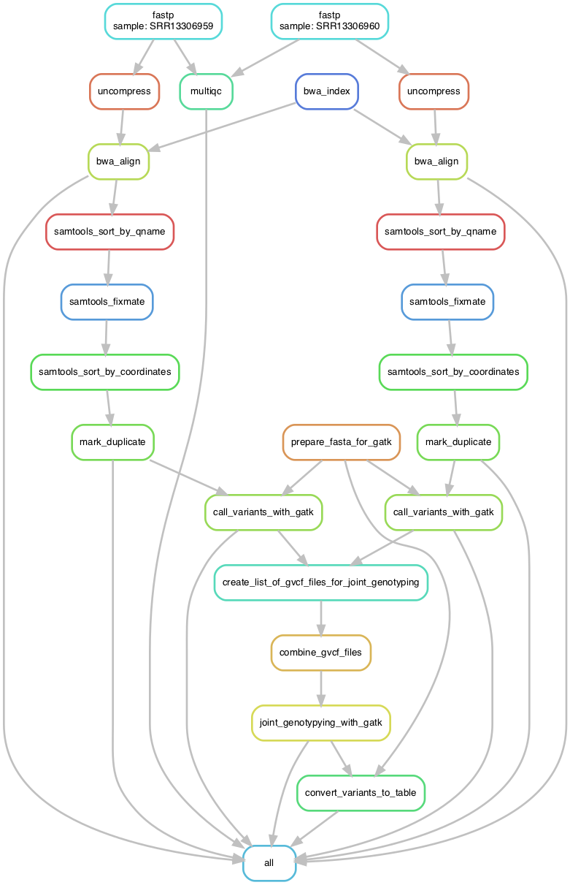
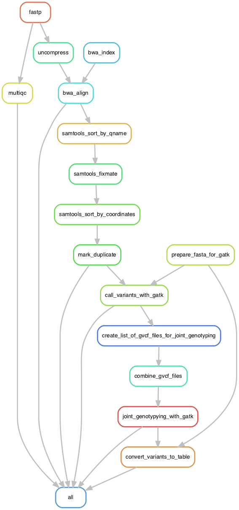

# Snakemake BSA-seq pipeline

A Snakemake pipeline to perform QTL mapping using Next Generation Sequencing Bulk Segregant Analysis (BSA-seq) to identify QTLs underlying a phenotype.

From Mansfeld et al. (2018) _Plant Genome_ 11(2). doi: 10.3835/plantgenome2018.01.0006. PMID: 30025013.  
> The BSA-seq procedure is performed by establishing and phenotyping a segregating population and selecting individuals with high and low values for the trait of interest. DNA from these individuals is pooled into high and low bulks which are subject to sequencing and single nucleotide polymorphism (SNP) calling, thus mitigating a need to develop markers in advance. In bulks selected from F2 populations, SNPs detected in reads derived from regions not linked to the trait of interest should be present in ∼50% of the reads. However, SNPs in reads aligning to genomic regions closely linked to the trait should be over- or under-represented depending on the bulk. Thus, comparing relative allele depths, or SNP-indices (defined as the number of reads containing a SNP divided by the total sequencing depth at that SNP) between the bulks can allow quantitative trait loci (QTL) identification (Takagi et al., 2013).

The output of the pipeline is a [GATK tab-delimited variant file](https://gatk.broadinstitute.org/hc/en-us/articles/360036896892-VariantsToTable) containing all SNP information from all samples. This can then be used with the [QTLseqR package](https://github.com/bmansfeld/QTLseqr/blob/master/vignettes/QTLseqr.pdf).   
The input of QTLseqr is the variant table as produced by the GATK `VariantsToTable` function. 

<!-- MarkdownTOC autolink="true" -->

- [Snakemake BSA-seq pipeline](#snakemake-bsa-seq-pipeline)
- [1. Installation 🔨](#1-installation-)
	- [1.1 Install Miniconda and mamba](#11-install-miniconda-and-mamba)
	- [1.2 Clone the pipeline repository :cat:](#12-clone-the-pipeline-repository-cat)
	- [1.3 Install the Snakemake pipeline dependencies](#13-install-the-snakemake-pipeline-dependencies)
- [2. Test run 🧪](#2-test-run-)
	- [2.1 Fastq test files](#21-fastq-test-files)
	- [2.2 Reference genome](#22-reference-genome)
	- [2.3 Change default parameters if needed](#23-change-default-parameters-if-needed)
	- [2.4 Run the pipeline](#24-run-the-pipeline)
- [3. Graphs](#3-graphs)
	- [For each sample (including reference sample)](#for-each-sample-including-reference-sample)
	- [For one given sample](#for-one-given-sample)
- [4. Downstream analysis with QTLseqR](#4-downstream-analysis-with-qtlseqr)
- [5. References 📖](#5-references-)
	- [QTLseqR software](#qtlseqr-software)
	- [Snakemake](#snakemake)
	- [VCF format specifications](#vcf-format-specifications)

<!-- /MarkdownTOC -->

# 1. Installation 🔨

## 1.1 Install Miniconda and mamba 

[Miniconda](https://docs.conda.io/en/latest/miniconda.html) is a lightweight installation of the `conda` package manager.  
[Mamba](https://mamba.readthedocs.io/en/latest/index.html) is a faster re-implementation of conda. These commands should be run inside your favorite Shell (e.g. `bash`).

To install `conda`, follow the instructions: - [Conda installation](https://docs.conda.io/projects/conda/en/latest/user-guide/install/)

Once `conda` is installed, you can get `mamba` easily in your default (base) conda environment:  

`conda install mamba -n base -c conda-forge --yes`

mamba is a much quicker alternative to conda with most commands being the same (replace "conda" by "mamba").

## 1.2 Clone the pipeline repository :cat:

From GitHub, copy the repo link: `https://github.com/SilkeAllmannLab/snakemake_bsaseq.git`

Then run `git clone https://github.com/SilkeAllmannLab/snakemake_bsaseq.git` on a cluster e.g. crunchomics. 
You will now have a folder named "snakemake_bsaseq/" from where all following commands should be run.

## 1.3 Install the Snakemake pipeline dependencies

Place yourself in the `snakemake_bsaseq/` folder and run:  

`mamba env create -f environment.yaml `

# 2. Test run 🧪

The test run reproduces the BSA-seq analysis to identify a QTL related to rice plant height coined _qPH9_ in the original study of Xin et al. 2022.

__Reference:__ Xin W, Liu H, Yang L, Ma T, Wang J, Zheng H, Liu W, Zou D. BSA-Seq and Fine Linkage Mapping for the Identification of a Novel Locus (qPH9) for Mature Plant Height in Rice (Oryza sativa). Rice (N Y). 2022 May 20;15(1):26. doi: [10.1186/s12284-022-00576-2](https://www.ncbi.nlm.nih.gov/pmc/articles/PMC9123124/). PMID: 35596038; PMCID: PMC9123124.

## 2.1 Fastq test files

The test fastq files are available from the [Zenodo here](https://zenodo.org/record/7728260). The BSA-seq data for this study can be found in the National Center for Biotechnology Information Sequence Read Archive under the accession numbers SRR13306959 (low plant height) and SRR13306960 (high plant height) under project number [PRJNA687818](https://www.ncbi.nlm.nih.gov/bioproject/PRJNA687818). A subset (10%) of SSRR13306959 and SRR13306960 were made for test purposes. 

Download the paired-end fastq files for both high height and low height individual pools and place them inside the `config/fastq/` folder (create it if necessary).  

## 2.2 Reference genome 

The rice genome reference assembly used is [Os-Nipponbare-Reference-IRGSP-1.0](https://rapdb.dna.affrc.go.jp/download/archive/irgsp1/IRGSP-1.0_genome.fasta.gz) that can be downloaded from the [Rice Annotation Project Database](https://rapdb.dna.affrc.go.jp/download/irgsp1.html).

The path to the genome should be added to the `config.yaml` file in the `ref_genome` argument. By default the chromosome 09 of the rice genome is used since the _qPH9_ QTL identified is located on chromosome 9. 

## 2.3 Change default parameters if needed

1. The pipeline parameters are visible in `config/config.yaml` and can be edited before the run is executed.   
2. Change the file path to your fastq files for the bulk mutant in `config/samples.csv`.  

:warning: In the `samples.csv` file, columns have to be named `sample`, `fq1`,`fq2`. 

## 2.4 Run the pipeline 

1. Activate the required environment to have all dependencies accessible in your $PATH: `conda activate bsaseq`    
2. Execute the pipeline: `snakemake -j 1` (specify N threads with `-j N`).  

On a cluster managed with SLURM such as the [UvA-FNWI crunchomics](https://crunchomics-documentation.readthedocs.io/en/latest/), if you specify 10 CPUs you can run with:    
`conda activate bsaseq && sbatch -J qtlseq --time=24:00:00 --cpus-per-task=10 --mem-per-cpu=4G snakemake -j 10`

This will (1) activate the bsaseq conda environment with all softwares required and (2) submit a SLURM job named "bsaseq" with 10 cpus and 4Gb of RAM per CPU. 

# 3. Graphs

These graphs display the order of tasks from beginning to end. 

## For each sample (including reference sample)

## For one given sample

# 4. Downstream analysis with QTLseqR 

An example variant table file and an example R script for QTL-seq analysis with [QTLseqr](https://github.com/bmansfeld/QTLseqr) is available in the `qtlseqr/` folder.

# 5. References 📖

## QTLseqR software

* [GitHub link](https://github.com/bmansfeld/QTLseqr)

* Citation: Mansfeld BN, Grumet R. QTLseqr: An R Package for Bulk Segregant Analysis with Next-Generation Sequencing. Plant Genome. 2018 Jul;11(2). doi: 10.3835/plantgenome2018.01.0006. PMID: 30025013.

## Snakemake 

* [Snakemake Documentation](https://snakemake.github.io/)

* Citation: Mölder, F., Jablonski, K.P., Letcher, B., Hall, M.B., Tomkins-Tinch, C.H., Sochat, V., Forster, J., Lee, S., Twardziok, S.O., Kanitz, A., Wilm, A., Holtgrewe, M., Rahmann, S., Nahnsen, S., Köster, J., 2021. Sustainable data analysis with Snakemake. F1000Res 10, 33. [Link](https://f1000research.com/articles/10-33/v2). 

## VCF format specifications

* [Legacy documentation of GATK](https://sites.google.com/a/broadinstitute.org/legacy-gatk-documentation/frequently-asked-questions/1268-What-is-a-VCF-and-how-should-I-interpret-it)